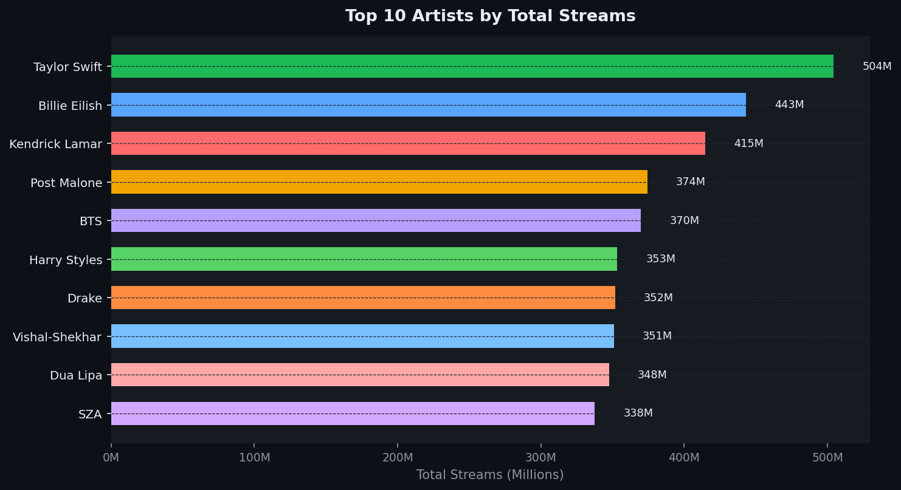
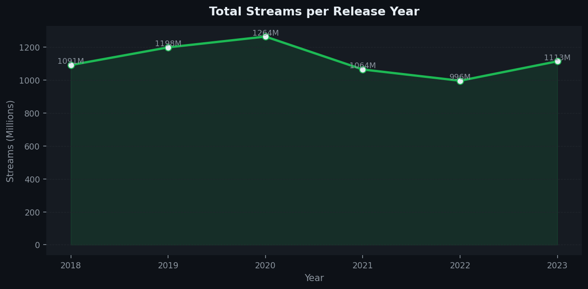
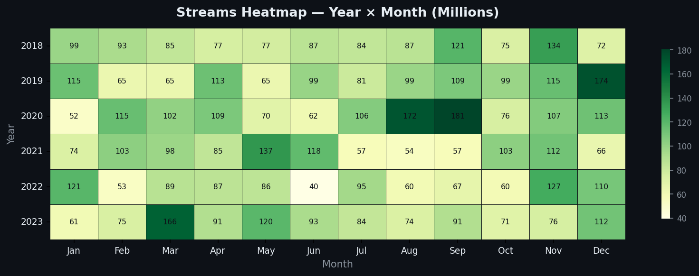
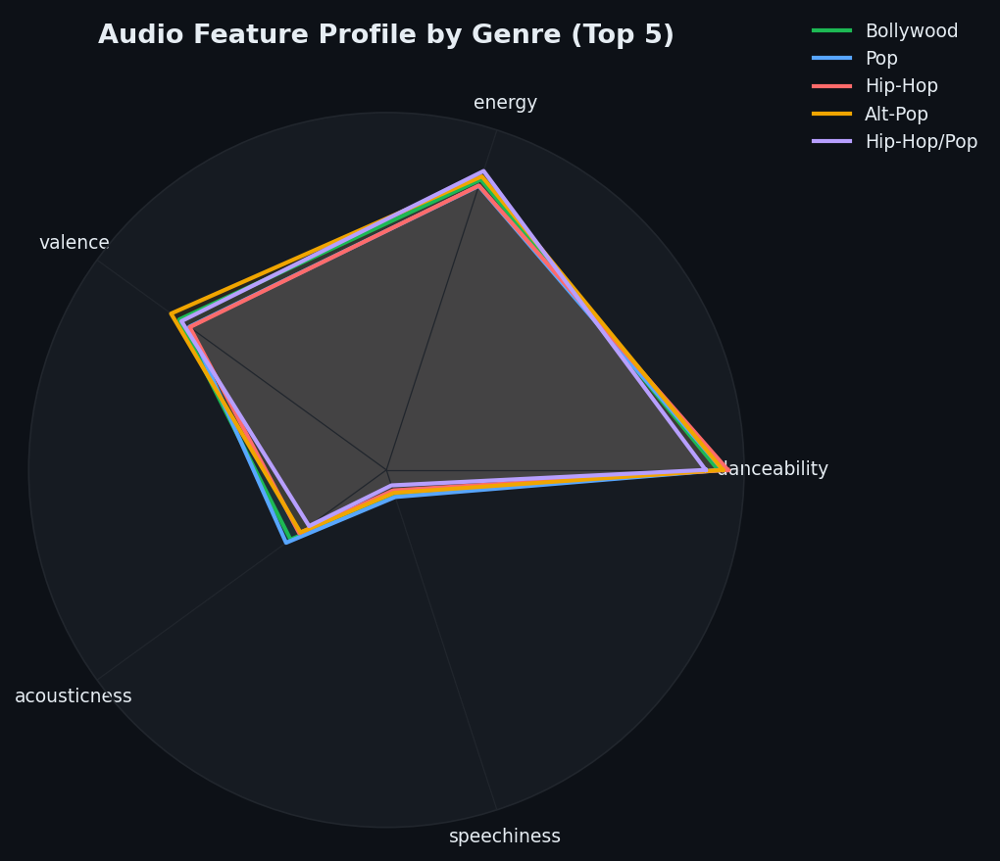

<div align="center">


</div>

<div align="center">


</div>

---

## 🎯 Project Overview

This project performs an end-to-end exploratory data analysis on a Spotify-style streaming dataset covering **1,200 tracks**, **20 artists**, **10 genres**, and **6 years of data (2018–2023)**.

> **The core question:** *What actually makes a track popular on Spotify — and which artists, genres, and audio features drive the most streams?*

All analysis is done in a **single Jupyter notebook** with Spotify-themed dark visualisations. No dashboards, no drag-and-drop — just clean Python that tells a clear business story.

---

## 📊 Questions Answered

| # | Business Question | Analysis |
|---|-------------------|----------|
| 1 | Which artists generate the most total streams? | Bar chart — top 10 by streams |
| 2 | Which genres dominate listening share? | Genre-level aggregation + share % |
| 3 | How are popularity scores distributed? | Histogram with mean/median lines |
| 4 | Is there a YoY growth trend in streams? | Line chart with fill + YoY % |
| 5 | Do danceability and energy predict popularity? | Scatter plot coloured by popularity |
| 6 | Which months and years peak for streams? | Year × Month heatmap |
| 7 | How do audio profiles differ by genre? | Radar chart — 5 genres × 5 features |
| 8 | What moods dominate different genres? | Grouped bar — mood distribution |

---

## 🗂️ Project Structure

```
spotify-data-analysis/
│
├── data/
│   └── spotify_tracks.csv         ← 1,200 tracks with 18 features
│
├── notebooks/
│   └── spotify_analysis.ipynb     ← Full analysis notebook (run top to bottom)
│
├── charts/                        ← All 8 output visualisations (PNG)
│   ├── 01_top_artists_streams.png
│   ├── 02_streams_by_genre.png
│   ├── 03_popularity_distribution.png
│   ├── 04_yearly_trends.png
│   ├── 05_danceability_vs_energy.png
│   ├── 06_monthly_heatmap.png
│   ├── 07_audio_features_radar.png
│   └── 08_mood_by_genre.png
│
└── README.md
```

---

## 🗃️ Dataset Features

| Column | Type | Description |
|--------|------|-------------|
| `track_name` | str | Song title |
| `artist_name` | str | Artist name |
| `genre` | str | Music genre |
| `release_year` | int | Year of release (2018–2023) |
| `release_month` | int | Month of release |
| `streams` | int | Total stream count |
| `popularity` | int | Spotify popularity score (0–100) |
| `duration_ms` | int | Track length in milliseconds |
| `danceability` | float | How suitable for dancing (0–1) |
| `energy` | float | Intensity & activity level (0–1) |
| `valence` | float | Musical positivity (0–1) |
| `tempo` | float | Beats per minute |
| `acousticness` | float | Acoustic confidence (0–1) |
| `loudness` | float | Overall loudness (dB) |
| `speechiness` | float | Spoken word presence (0–1) |
| `mood` | str | Classified mood tag |

**1,200 rows · 18 columns · 0 nulls**

---

## 📈 Key Findings

### 🎤 Artists & Genres
- **Taylor Swift** leads all artists with **504M streams**, followed by Billie Eilish (443M) and Kendrick Lamar (415M)
- **Pop** and **Bollywood** account for nearly **45% of total streams** combined
- **R&B and Hip-Hop** have the highest average streams *per track* — fewer releases, higher impact per song

### 🔊 Audio Features & Popularity
- **Danceability** shows the strongest positive correlation with popularity score
- Tracks with popularity **80–95** cluster in the high-energy + high-danceability quadrant
- **Acoustic tracks** score lower in popularity on average — electronic production edges out organic sound

### 📅 Seasonal Trends
- **September–October** show the highest stream peaks across nearly every year — festive season effect
- **2021 saw the largest YoY growth** in streams, likely driven by pandemic-era listening surge
- Release strategy matters: tracks dropped in Q3 (Jul–Sep) accumulate streams faster

### 🌀 Genre Audio Profiles (Radar)
- **Hip-Hop** scores highest on energy and speechiness
- **Bollywood** leads on valence (positivity) and danceability
- **Indie-Pop** is the most acoustic genre, with the lowest energy profile

---

## 📸 Charts Preview

<table>
  <tr>
    <td></td>
    <td></td>
  </tr>
  <tr>
    <td align="center"><sub>Top 10 Artists by Streams</sub></td>
    <td align="center"><sub>Yearly Streaming Trend</sub></td>
  </tr>
  <tr>
    <td></td>
    <td></td>
  </tr>
  <tr>
    <td align="center"><sub>Year × Month Heatmap</sub></td>
    <td align="center"><sub>Audio Feature Radar by Genre</sub></td>
  </tr>
</table>

---

## 🚀 How to Run

### Prerequisites
```bash
pip install pandas numpy matplotlib seaborn jupyter
```

### Steps
```bash
# 1. Clone the repo
git clone https://github.com/DheerajKandpal/spotify-data-analysis.git
cd spotify-data-analysis

# 2. Launch Jupyter
jupyter notebook notebooks/spotify_analysis.ipynb

# 3. Run all cells top to bottom (Kernel → Restart & Run All)
```

> All charts are saved automatically to the `charts/` folder when you run the notebook.

---

## 🛠️ Skills Demonstrated

| Skill | Where |
|-------|-------|
| Data loading & cleaning with `pandas` | Section 2 — Overview |
| Descriptive statistics | `.describe()`, null checks, shape |
| Grouped aggregations | `groupby`, `pivot_table` |
| Data visualisation | 8 chart types across matplotlib + seaborn |
| Correlation analysis | Feature correlation with popularity |
| Heatmaps | Year × Month streaming patterns |
| Radar charts | Multi-feature genre comparison |
| Insight communication | Key findings section + cell markdown |

---

## 📬 Connect

<div align="center">

[](https://linkedin.com/in/dheerajkandpal)
[](https://github.com/DheerajKandpal)
[](mailto:dheeraj.kandpal@surepass.io)

</div>

---

<div align="center">

<sub>Built with 🐍 Python · Analysis notebook is fully reproducible · Charts in Spotify dark theme</sub>
</div>
